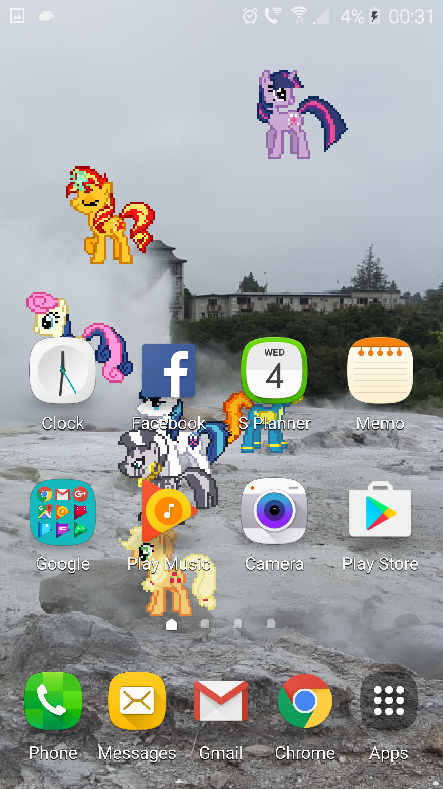

# PonyPaper
A live wallpaper for Android using pixel-art sprites of characters from My Little Pony: Friendship is Magic.

   

## Installation
This wallpaper should be compatible with any device running Android 2.2 (Froyo) or higher.

1. Download the latest version of PonyPaper-release.apk from [the releases page](http://github.com/Smithers888/PonyPaper/releases).
2. Open the file on your device to install the app. Your device may prompt you to allow installation of non-market apps.
3. To use the wallpaper, go to the home screen and press and hold the background. Navigate the ensuing dialogs to set the wallpaper of the home screen from "Live wallpapers". Next, select the "Pony Paper" wallpaper.
4. To configure which ponies the wallpaper will use, choose "Settings". The wallpaper will display four of the selected ponies at once, periodically one will leave the screen to be replaced with another.
5. Choose "Set wallpaper".
6. Watch colourful ponies trot, fly and teleport across your screen.

## Custom ponies
See [custom/README.md](custom/README.md)

## Licensing/Credits
All artwork was created by contributors to the Desktop Ponies team (who have a [DeviantArt group here](http://desktop-pony-team.deviantart.com/) and a [source repository here](https://github.com/RoosterDragon/Desktop-Ponies)). It is licensed under [Creative Commons Attribution-NonCommercial-ShareAlike 3.0 Unported (CC BY-NC-SA 3.0)](http://creativecommons.org/licenses/by-nc-sa/3.0/).

The source code was created by [Smithers888](http://cpjsmith.uk) and is available under the same license.

This means that anyone is free to share and modify this project, provided you give credit, do not use it commercially and allow others to use your modifications under the same terms.
