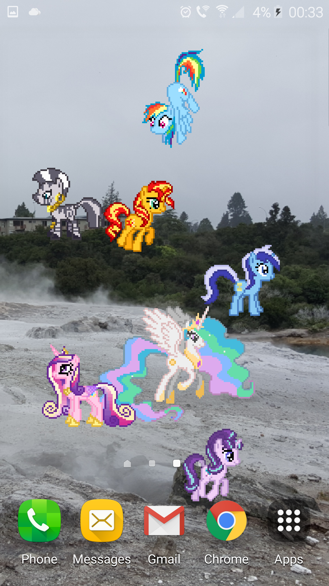
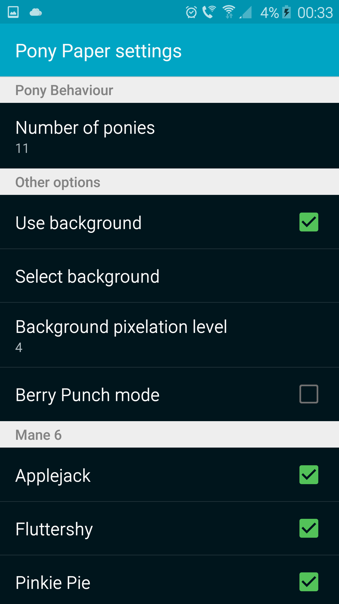

# PonyPaper
A live wallpaper for Android using pixel-art sprites of characters from My Little Pony: Friendship is Magic.

Basically, it's a bit like [Desktop Ponies](https://github.com/RoosterDragon/Desktop-Ponies), but for Android phones and tablets, instead of PC (and it has a lot fewer features and doesn't come with as many ponies).

    

## Installation
This wallpaper should be compatible with any device running Android 3.0 (Honeycomb) or higher.

1. Download `PonyPaper-release.apk` from [the latest release](http://github.com/Smithers888/PonyPaper/releases).
2. Open the file on your device to install the app. Your device may prompt you to allow installation of non-market apps.
3. To use the wallpaper, go to the home screen and press and hold the background. Navigate the ensuing dialogs to set the wallpaper of the home screen from "Live wallpapers". Next, select the "Pony Paper" wallpaper.
4. Optional: choose "settings" and configure the wallpaper as listed below.
5. Choose "Set wallpaper".
6. Watch colourful ponies trot, fly and teleport across your screen.

## Settings
* Most of the options are to enable or disable specific ponies. The wallpaper will display four of the selected ponies at once; periodically one will leave the screen to be replaced with another.
* Another option adds custom ponies to the rotation; information on creating these is at  [custom/README.md](custom/README.md).
* Additionally, you can select an image to use as a background. You may select any image stored on your device (be it one of your own photographs or something found on a web search for your favourite Equestrian location). The image will be automatically pixellated to better fit in with the ponies.

## Licensing/Credits
All artwork was created by contributors to the Desktop Ponies team (who have a [DeviantArt group here](http://desktop-pony-team.deviantart.com/) and a [source repository here](https://github.com/RoosterDragon/Desktop-Ponies)). It is licensed under [Creative Commons Attribution-NonCommercial-ShareAlike 3.0 Unported (CC BY-NC-SA 3.0)](http://creativecommons.org/licenses/by-nc-sa/3.0/).

The source code was created by [Smithers888](http://cpjsmith.uk) and is available under the same license.

This means that anyone is free to share and modify this project, provided you give credit, do not use it commercially and allow others to use your modifications under the same terms.
